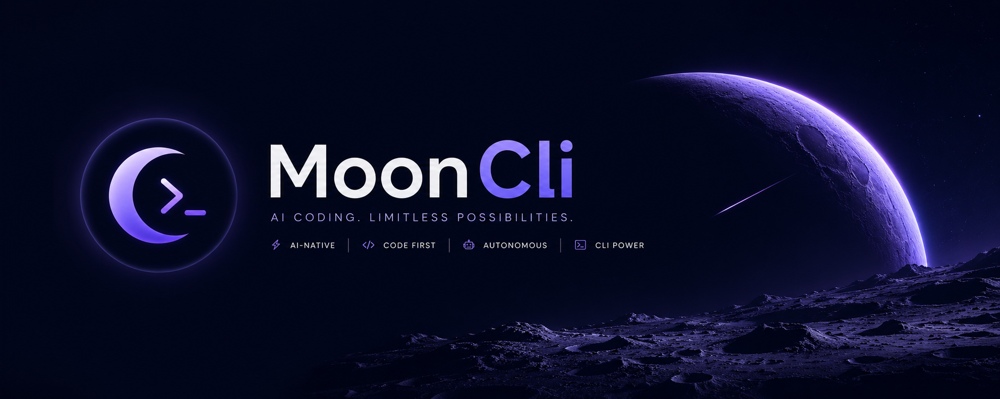

<div align="center">
  

  <br />

  [](https://www.npmjs.com/package/mooncli)
  [](LICENSE)
  [](https://discord.com/invite/3cU7Bz4UPx)

  ### **Mooncli**
  *An agentic coding assistant that lives in your terminal.*

  **Multi-provider · Multi-model · MCP-ready · Local-first · Open source**

</div>

---

## ⚡ What is Mooncli?

Mooncli is a high-performance, terminal-based coding agent designed for developers who prefer staying in their flow. Unlike browser-based LLM chats, Mooncli treats your codebase as the source of truth—reading files, reasoning about architecture, and executing changes directly.

- **🚀 Keyboard-Centric:** No more context-switching to browser tabs.
- **🧠 Agentic Intelligence:** Sophisticated orchestration for complex multi-file tasks.
- **🔒 Local-First:** Full privacy with Ollama and local model support.
- **🛠️ Extensible:** Custom tools, skills, and themes to match your workflow.

---

## 🏗️ Supported Providers

Mooncli bridges the gap between cloud power and local privacy.

| Category | Providers |
| :--- | :--- |
| **Cloud** | Anthropic (Claude 3.5/3.7), OpenAI (o1/o3), Google Gemini, DeepSeek, Mistral, xAI, Groq, Cerebras, OpenRouter, AWS Bedrock, Azure, GitHub Copilot |
| **Local** | **Ollama** (Qwen2.5-Coder, Llama 3, etc.), OpenAI-compatible local endpoints |

---

## 🚀 Quick Start

Get up and running in seconds.

```bash
# Install globally via npm
npm install -g mooncli

# Launch the interactive workspace
mooncli
```

### Configure Your Brain
```bash
# Set your preferred cloud provider
export GEMINI_API_KEY=your_key
export ANTHROPIC_API_KEY=your_key

# Or go fully local
ollama pull qwen2.5-coder:7b
mooncli --provider ollama
```

---

## ✨ Key Features

### 🏢 Multi-Agent Orchestration
Enable a full "virtual company" with `/agentmode on`. Mooncli spawns specialized agents (Architect, Frontend, Backend, Security, Test) that collaborate under a Patron orchestrator to solve large-scale problems.

### 🗺️ Plan Mode
Switch to `/plan` for a read-only analysis. The model will scan your project and propose a detailed implementation plan without making any changes. Review it, refine it, then execute.

### 🌐 Chrome Browser Bridge
Full web interaction. Mooncli connects to a bundled Chrome extension, allowing the assistant to browse docs, test web apps, and interact with live pages through `/browser`.

### 🗜️ Context Management
Keep your sessions lean. Mooncli features automatic and manual context compaction (`/compact`) and a real-time token usage monitor (`/context`).

---

## ⌨️ Interactive Commands

| Command | Action |
| :--- | :--- |
| `/models` | Switch active model mid-session |
| `/agentmode` | Toggle multi-agent orchestration |
| `/plan` | Enter/Exit read-only planning mode |
| `/index` | Index codebase for semantic search |
| `/browser` | Verify Chrome bridge status |
| `/mcp` | Manage Model Context Protocol servers |
| `/context` | Monitor token & context window usage |
| `/export` | Export session to HTML or JSONL |
| `/mood` | Inspect the agent's affective state layer |

---

## 🛠️ Development & Contribution

We love contributions! Whether it's adding a new provider, fixing a bug, or improving documentation.

```bash
# Clone the repository
git clone https://github.com/theayzek01/hodeuscli

# Install dependencies
npm install

# Run checks (lint + typecheck)
npm run check

# Build and run locally
npm run build
node packages/cli/dist/cli.js
```

---

<div align="center">
  <p>Built with ❤️ by the Mooncli community.</p>
  <p>Released under the <a href="LICENSE">MIT License</a>.</p>
</div>
