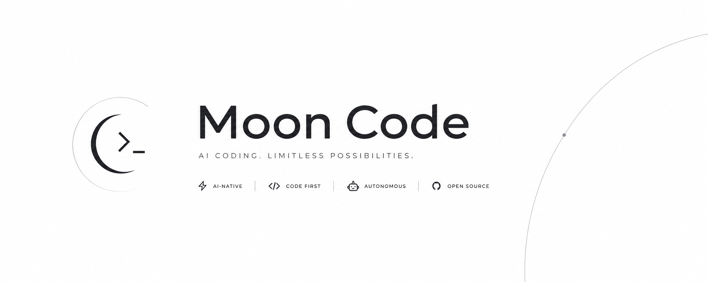

<div align="center">
  
  <br />
  <p>
    <b>MoonCode 2026-v23</b><br />
    Terminal tabanlı, minimal ve akıllı otonom yazılım geliştirme ajanı.
  </p>
  <p>
    
    
    
    
  </p>
</div>

---

## Genel Bakış

**MoonCode**, en minimal kaynak tüketimi (düşük token kullanımı) ve en yüksek odaklanma ile doğrudan terminalinizden çalışan otonom bir kodlama asistanıdır. Gelişmiş metadata bazlı indeksleme, dynamic tool yönlendirme ve optimize edilmiş hafıza sistemleriyle kod tabanınızı analiz eder, otonom düzenlemeler yapar ve görevleri tamamlar.

---

## Öne Çıkan Özellikler

* **Ultra-Düşük Token Sarfiyatı:** Akıllı metadata ve sembol-bazlı indeksleme sayesinde bağlam pencerelerini doldurmaz, hızlı ve ucuz çalışır.
* **Dynamic ADHD Tool Router:** Basit ve casual sohbetlerde gereksiz ağır araç şemalarını yüklemez; teknik görevlerde ise tüm yetenekleri otomatik devreye sokar.
* **Temiz Çalışma Alanı (Merkezi Hafıza):** Proje dizinlerinizi `.mooncode.md` veya benzeri kalıcı dosyalarla kirletmez; tüm hafıza ve geçmişi merkezi `~/.moonagent` dizini altında güvenle yönetir.
* **Gelişmiş TUI Arayüzü:** Akıllı Spacer ve Padding mantığıyla composer (yazma alanı) her zaman ekranın en altında sabit kalır. FPS donmalarına karşı Virtualized render korumalıdır; 2026-v23 ile render tepkiselliği artırıldı.
* **/app Web Studio:** TUI kilidiyle birlikte çalışan web arayüzü üzerinden aktif oturuma mesaj gönderme ve kilidi açma akışı desteklenir.
* **Hızlı Codex/OpenAI Akışı:** 2026-v23 retry/backoff ayarlarıyla Codex/GPT streaming gecikmeleri azaltıldı.
* **Browser Bridge & Akıllı Screenshot:** Entegre Chrome uzantısıyla tarayıcıyı kontrol eder. Modeliniz görsel (Vision) girdi destekliyorsa ekran görüntülerini anında analiz eder, desteklemiyorsa sistem kaynaklarını korumak için screenshot özelliğini otomatik kapatır.

---

## Kurulum ve Çalıştırma

### 1. Derleme ve Global Link
```bash
git clone https://github.com/theayzek01/MoonCode.git
cd MoonCode
npm install
npm run build
cd packages/cli
npm link
```

### 2. Başlatma
Projenizin kök dizinine gidip çalıştırın:
```bash
mooncode
```

---

## Ekran Görüntüsü

<div align="center">
  
</div>

---

## Komut Navigasyonu

TUI arayüzündeyken kullanabileceğiniz temel komutlar:

| Komut | Açıklama |
| :--- | :--- |
| `/help` | Tüm klavye kısayollarını ve komut listesini gösterir. |
| `/index` | Projenin semantik kod ve sembol haritasını çıkarır. |
| `/browser` | Web araştırması veya tarayıcı kontrol modunu başlatır. |
| `/compact` | Mevcut sohbet bağlamını sıkıştırarak token tasarrufu sağlar. |
| `/ship` | Git commit, push ve PR akışını tek komutla tamamlar. |

---

## Topluluk ve Bağlantılar

* **Discord:** [discord.gg/kanser](https://discord.gg/kanser)
* **Instagram:** [@theayzek01](https://instagram.com/theayzek01)

---

## Lisans

MIT © 2026 Ayzek
