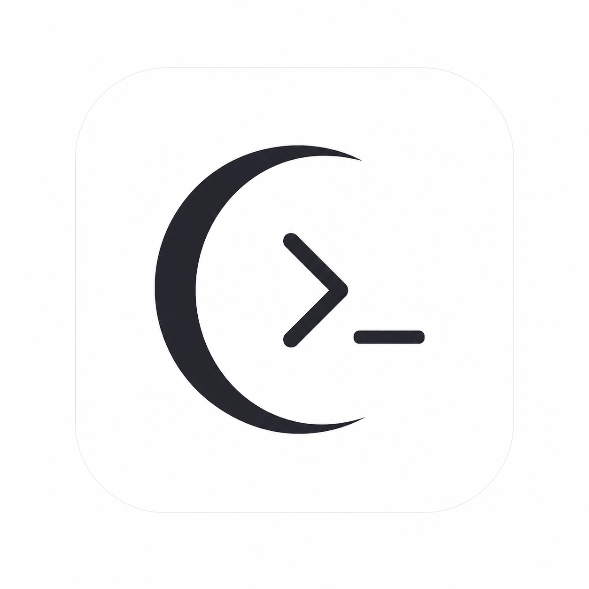

<div align="center">
  
  
  <br>
  
  <p align="center">
    
    
    
    
  </p>
  <p align="center"><b>Sürüm: 2026-Pre16 (Apex Mode Active)</b></p>
</div>

<br>

---

<br>

# ✦ MoonCode
### Dünyanın İlk 3D Grafik & Detaylı Oyun Destekli Otonom Mühendislik Terminali

Yapay zeka asistanları bugüne kadar 3D oyunlar, Roblox modelleri veya Three.js / WebGL sahneleri kodlarken hep aynı hataya düştü: **"Acemi ve bebek seviyesi"** kalitesiz tasarımlar, düz küpler, basit materyaller ve profesyonellikten uzak asset kullanımı. 

**MoonCode bu düzene son veriyor.** 

MoonCode, dünyada ilk kez otonom bir terminal asistanına entegre edilen **3D Game & Graphics Cognitive Core** ile yapay zekayı profesyonel bir 3D Grafik Sanatçısına dönüştürüyor. Artık 3D Roblox oyunları, sofistike WebGL projeleri ve karmaşık mesh hiyerarşileri otonom olarak ve olağanüstü bir ince işçilikle inşa ediliyor.

<br>

<div align="center">
  
  <p><i>v2026-Pre16 Güncellemesi: Yeni Lüks Emojisiz Durum Çubuğu & Ultra-Kararlı Web Entegrasyonu</i></p>
</div>

<br>

---

<br>

## ❖ Neden MoonCode?

### 1. ✦ 3D Oyun & Grafik Devrimi (Dünyada Bir İlk)
Diğer yapay zekalar sadece "kod yazar". MoonCode ise profesyonel 3D tasarım prensiplerini bilir:
* **Micro-Detail Geometry:** Basit "red cube, blue sphere" oyuncaklar yerine, yumuşatılmış köşeler (beveling), çoklu mesh hiyerarşileri ve organik formlar üretir.
* **PBR (Physically Based Rendering):** Roughness, metalness, normal maps ve dynamic environment maps kullanarak yüzeylere gerçekçi doku kazandırır.
* **Shaders & Shading:** Custom GLSL Shaders kullanarak büyüleyici parçacık sistemleri ve post-processing (Bloom, Depth-of-Field, Ambient Occlusion) entegrasyonu yapar.
* **Roblox & Lua 3D Pro-Level:** Gelişmiş mesh part'ları, pürüzsüz smooth terrain haritaları, constraint-based fizik sistemleri (yaylar, menteşeler) ve modern Lua kütüphane pratiklerini harmanlar.

### 2. ✦ Ultra-Premium Cognitive TUI (v2026-10)
Emojilerin getirdiği o "çocuksu" ve sıradan terminal havası tamamen kaldırıldı. Yerine siberpunk ve kozmik asilliğe uygun, tamamen profesyonel Unicode sembolleri yerleştirildi:
```
 ○ WEB │ ✦ S0 │ ✓ DONE │ ⚙ gemini-3.5 │ ⚛ THINK HIGH │ ☷ CTX 0% auto │ ◆ COST $0.00 │ ⛁ RSS 165MB
```
* **Otomatik Satır Kaydırma (Multi-row Wrap):** Ekran genişliği daraldığında alt paneldeki hiçbir bilgi (tam model adı, harcama sayacı vb.) kırpılmaz, akıllıca alt satıra geçer.
* **Canlı USD Harcama Takibi (`◆ COST`):** Yapılan her asistan isteğinin ardından harcanan API maliyetini yeşil tonlu dijital sayaçla anlık olarak gösterir.
* **Moon Apex Teması:** Arka planda kozmik uzay obsyeni (`#0a0b10`), neon mor (`#c084fc`) ve turkuaz (`#22d3ee`) neon renk vurgularıyla gözlerinizi yormayan elit bir kodlama deneyimi.

### 3. ✦ Sıfır Token İsrafı (Semantik AST Filtreleme)
MoonCode, geleneksel asistanlar gibi binlerce satırlık dosyalarınızı LLM'e kopyalayıp tokenlarınızı yakmaz. **AST tabanlı semantik indeksleme** kullanarak sadece ilgili kod parçacıklarını seçer.
* **Okunan Token (1 İstek):** ~500 Token (Geleneksel araçlarda ~15.000 Token)
* **Maliyet Oranı:** Ortalama %96 daha ucuz.

### 4. ✦ Tek Portlu Kararlı Web Köprüsü (Browser Bridge)
Port çakışmaları, duplicate sunucu başlatma hataları ve süreç sızıntıları tamamen tarihe gömüldü. Terminal açık olduğu sürece tek port üzerinden çalışan, tarayıcı eklentisiyle %100 senkronize olan ve kararlılığı doğrulanan yeni web mimarisi devrede!

<br>

---

<br>

## ❖ Kurulum & Başlangıç

Sadece birkaç komutla çalışmaya hazır:

```bash
git clone https://github.com/theayzek01/MoonCode.git
cd MoonCode

# 1. Bağımlılıkları Yükle
npm install

# 2. Projeyi Derle
npm run build

# 3. Global Olarak Bağla (npm link)
cd packages/cli
npm link
```

Kurulum tamamlandıktan sonra herhangi bir projede terminale `mooncode` yazmanız yeterlidir.

### ⚠️ PATH Hatası (Command Not Found / gg) Çözümü

Eğer terminale `mooncode` yazınca komut bulunamadı hatası alıyorsanız (PATH tanımlanmamış demektir), işletim sisteminize göre aşağıdaki adımları takip edin:

#### 1. Windows için Çözüm:
1. `npm config get prefix` komutunu çalıştırın ve çıktıyı kopyalayın (örn: `C:\Users\KullaniciAdi\AppData\Roaming\npm`).
2. Windows Arama çubuğuna **"Sistem ortam değişkenlerini düzenleyin"** yazın ve açın.
3. **"Ortam Değişkenleri"** butonuna tıklayın.
4. **"Kullanıcı değişkenleri"** altında yer alan `Path` değişkenini seçip **Düzenle** deyin.
5. **Yeni** butonuna basarak kopyaladığınız yolu buraya ekleyin ve **Tamam**'a basıp tüm pencereleri kapatın.
6. Yeni bir terminal (PowerShell veya CMD) açıp `mooncode` yazarak çalıştırın.

#### 2. macOS / Linux için Çözüm:
Terminalinizde kullandığınız kabuğa (shell) göre global npm yolunu PATH'e ekleyin:

**Bash kullanıyorsanız (`~/.bashrc` veya `~/.bash_profile`):**
```bash
echo 'export PATH="'$(npm config get prefix)'/bin:$PATH"' >> ~/.bashrc
source ~/.bashrc
```

**Zsh kullanıyorsanız (`~/.zshrc` - macOS Varsayılanı):**
```bash
echo 'export PATH="'$(npm config get prefix)'/bin:$PATH"' >> ~/.zshrc
source ~/.zshrc
```

<br>

---

<br>

## ❖ İstasyon Komutları

Yapay zekayı yönlendirmek için terminalden bu komutları kullanabilirsiniz:

| Komut | Yetenek | Açıklama |
| :--- | :--- | :--- |
| **`/swarm`** | **❖** Sürü Zekası | Büyük işleri mimar, coder ve reviewer ajanlarına bölerek paralel çözdürür. |
| **`/fix`** | **⚙** Otonom Tamir | Projedeki derleme veya linter hatalarını bulur ve tamamen düzelene kadar loop'a girer. |
| **`/evolve`**| **⌬** Meta-Evrim | MoonCode'un kendi kaynak kodunu okup kendini geliştirmesini sağlar. |
| **`/index`** | **☷** Vektör Dizini | Hızı 10 kat artırmak için projenin AST tabanlı anlamsal (semantic) haritasını çıkarır. |
| **`/browser`**| **◧** Web Köprüsü | Terminalden çıkmadan web'te araştırma yapmasını veya döküman okumasını sağlar. |

<br>

---

<br>

## ❖ İletişim & Topluluk

* **Discord:** [discord.gg/kanser](https://discord.gg/kanser)
* **Instagram:** [@theayzek01](https://instagram.com/theayzek01)

<br>

<div align="center">
  
  <br><br>
  <b>Hızlı hareket et. Sorunları çöz. Moon kal.</b>
  <br><br>
  <sub>MIT License | Copyright (c) 2026 Ozen (theayzek01)</sub>
</div>
