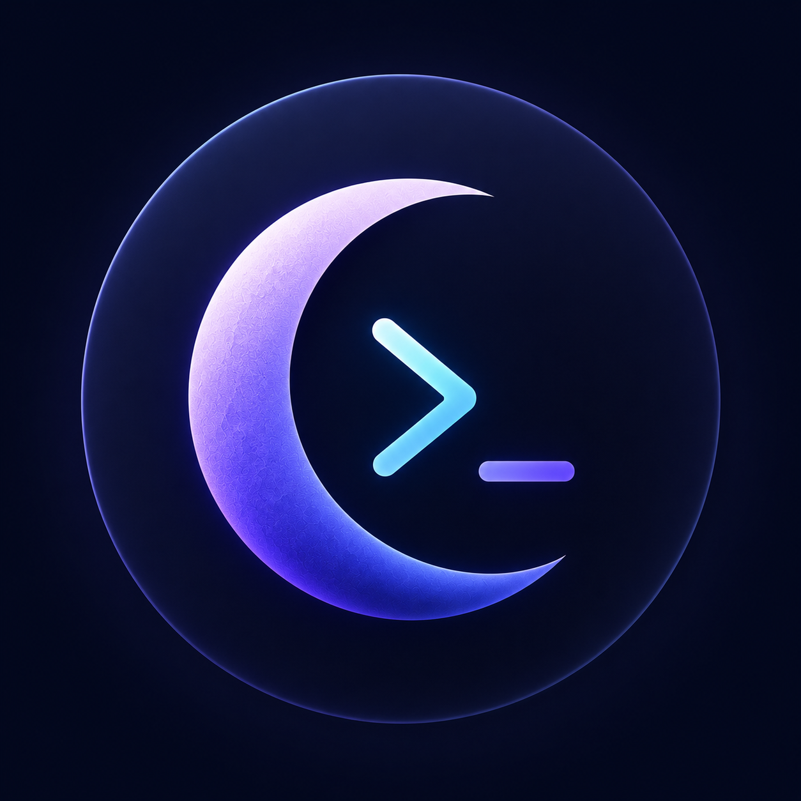

<div align="center">
  
</div>

<br>

# ✦ MoonCode

MoonCode, terminalden çıkmadan bütün projeyi yönetmeni sağlayan otonom bir mühendislik asistanıdır. 

Sadece kod yazıp bırakmaz; projeni okur, testleri çalıştırır, hataları bulur ve sen onay verene kadar düzeltir. 

<br>

---

<br>

## ❖ Neden MoonCode?

Piyasada bir sürü AI aracı var (Cursor, Claude Code, Windsurf vb.). MoonCode'un onlardan farkı ne?

<br>

| Özellik | MoonCode | Diğer Araçlar |
| :--- | :--- | :--- |
| **Otonomi** | **✓** Tam Otonom (Kendi test eder, düzeltir) | **✕** Sadece Kod Önerir |
| **Token Kullanımı** | **✓** Semantik Filtre (%80 Tasarruf) | **✕** Tüm Dosyayı Gönderir |
| **Çalışma Ortamı** | **✓** Native Terminal (Çok Hafif) | **✕** Ağır IDE (Electron) |
| **Sürü Zekası** | **✓** Paralel Ajanlar (Mimar, Coder) | **✕** Tekil Model |

<br>

**◈ Gerçek Otonomi:** Hata mı çıktı? Kodu yazar, testi koşturur, hata alırsa logları okuyup tekrar dener. Sen sadece en son çıkan doğru koda onay verirsin.

**◈ Cebini Düşünür:** Diğer araçlar her soruda tüm projeyi yapay zekaya gönderip kredi yakarken, MoonCode kendi içindeki filtreleme sistemiyle sadece gerekli dosyaları bulur. Ortalama %80 daha ucuzdur.

<br>

---

<br>

## ❖ Kurulum

Sadece birkaç komutla çalışmaya hazır:

```bash
git clone https://github.com/theayzek01/MoonCode.git
cd MoonCode

npm install
npm run build
npm install -g ./packages/cli
```

<br>

---

<br>

## ❖ Nasıl Kullanılır?

Terminale sadece `mooncode` yazman yeterli.

**1 ▹ İsteğini söyle:** Örn: _"Kullanıcı giriş sistemini yaz ve testlerini ekle."_
**2 ▹ Arkanı yaslan:** MoonCode dosyaları tarar, plan yapar ve kodu yazar.
**3 ▹ Onayla:** Ekrana gelen değişiklikleri kontrol et, mantıklıysa terminalden onayla ve dosyalarına işlensin.

<br>

### ✧ Sık Kullanılan Komutlar

* **`/swarm`** ⏤ Çok büyük bir özellik mi ekleyeceksin? Bu komut işi parçalara böler ve arka planda birden fazla ajana dağıtır.
* **`/fix`** ⏤ Projendeki derleme veya linter hatalarını bulup otomatik olarak çözer.
* **`/browser`** ⏤ MoonCode'un terminalden çıkmadan webt'te araştırma yapmasını sağlar.

<br>

---

<br>

## ❖ İletişim & Topluluk

Projeyle ilgili bir sorun yaşarsan, fikir vermek istersen veya sadece muhabbet etmek istersen buradayız:

* **Discord:** [discord.gg/kanser](https://discord.gg/kanser)
* **Instagram:** [@theayzek01](https://instagram.com/theayzek01)

<br>

---

<br>

<div align="center">
  
  <br><br>
  <b>Hızlı hareket et. Sorunları çöz. Moon kal.</b>
  <br><br>
  <sub>MIT License | Copyright (c) 2026 Ozen (theayzek01)</sub>
</div>
