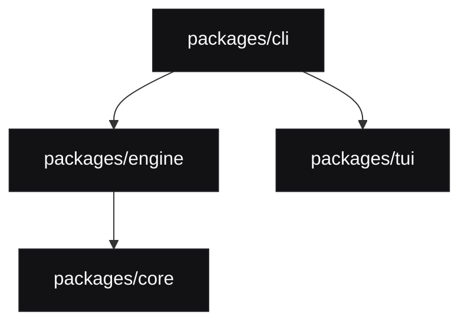

# MoonAgent Deep Dive & Architectural Reference Manual

This document provides a comprehensive structural guide to MoonAgent's design philosophy, monorepo architecture, execution modes, tool interfaces, MCP integrations, and local development lifecycles. It is curated specifically for senior developers and system architects looking to refactor or extend the codebase.

---

## 1. What is MoonAgent?

MoonAgent is a terminal-centric software development agent designed for low-latency, autonomous codebase operations. Unlike traditional chat-first LLM wrappers, MoonAgent's core architecture is built around **maximum token economy** and strict **correctness verification**.

### Core Operational Principles
*   **Token Efficiency**: Strictly minimizes context window bloat via context-aware token tracking and aggressive semantic compaction.
*   **Targeted Diff Execution**: Modifies only the narrowest possible contiguous line blocks in the target files, preventing destructive rewrites.
*   **Unified Multi-Tool Surface**: Merges interactive bash environments, a local Chrome Browser Bridge, custom TUI elements, and MCP protocols into a unified developer runtime.
*   **Idempotency & Safety**: Enforces the `inspect → act → verify` execution loop for all autonomous workflows.

---

## 2. Quick Start & Path Configuration

MoonAgent is designed to be highly pluggable and easily bootstrapped in any standard UNIX/Windows terminal workspace.

### Core Installation Workflow
```bash
# 1. Clone the repository
git clone https://github.com/theayzek01/mooncode.git
cd mooncode

# 2. Install monorepo dependencies
npm install

# 3. Compile all packages in lockstep
npm run build

# 4. Link the CLI globally to your PATH
npm install -g ./packages/cli
```

### Path & Directory Configuration
MoonAgent relies on designated paths for assets, configurations, and persistent workspaces. These can be fully overridden using standard environment variables:

*   **`MOON_PACKAGE_DIR`**: Root asset resolution path. Defines where themes, HTML templates, and CLI assets are stored.
*   **`MOON_SHARE_VIEWER_URL`**: Base URL for hosting and displaying shareable session logs and traces.
*   **`MOON_CODING_AGENT_DIR`**: The primary user directory for model configurations, credential syncs, and custom themes (Defaults to `~/.mooncode/engine/`).

---

## 3. Potential Errors & Troubleshooting Guide

Common operational edge-cases and their structural mitigation strategies are documented below:

### Error 1: UND_ERR_BODY_TIMEOUT (SSE Body Stream Interruption)
*   **Cause**: Triggered when a slow local provider (e.g., Ollama) or complex reasoning models under Antigravity spend more than 300 seconds formatting large payload responses.
*   **Mitigation**: MoonAgent overrides Undici's global dispatcher timeouts on start. If issues persist, verify that your local network/proxy is not hard-imposing intermediate write deadlines.

### Error 2: Browser Bridge Offline
*   **Cause**: The local WebSocket bridge server failed to bind to its port, or the Chrome extension lacks permissions.
*   **Mitigation**: Run `/browser` inside the interactive session to query connection diagnostics. Ensure port `11434` is unblocked and is not consumed by concurrent processes.

### Error 3: Render Alignment Issues in TUI
*   **Cause**: Massive terminal window resizing events during active stream outputs may occasionally break scroll anchor bounds.
*   **Mitigation**: Send a `/reload` command or press `Ctrl + R` to immediately redraw the canvas grid.

---

## 4. High-Level Architecture

MoonAgent is built as a highly decoupled monorepo, separating UI presentation, core domain logic, tool executors, and entry orchestration into dedicated packages:



1.  **`packages/tui`**: A high-performance, low-level Terminal Text User Interface rendering library with a custom component engine and differential redraw capabilities.
2.  **`packages/core`**: The foundational package housing shared interfaces, canonical model registers (e.g., the Antigravity provider mapping), and helper methods.
3.  **`packages/engine`**: The operational runtime core managing tool invocation boundaries, subprocess execution, and stdio-based MCP connectivity.
4.  **`packages/cli`**: The product layer, orchestrating interactive sessions, slash command routing, system prompt composition, and the Browser Bridge server.

---

## 5. Bootstrapping and Runtime Flow

Executing `mooncode` initiates a deterministic bootstrapping sequence:

1.  **Install Detection & Config Boot**: Detects global paths and reads local configurations from the `.mooncode` package folder.
2.  **Session Orchestration (`EngineSession`)**: Establishes or resumes a stateful workspace session. If resuming, it reloads files and outline states.
3.  **Model & Provider Resolution**: Validates model bindings against active providers (such as `antigravity`'s Gemini and Claude endpoints).
4.  **Dynamic System Prompt Assembly**: Gathers current repository paths, design tokens, active tool schemas, and custom guidelines to build a context-optimized system prompt.
5.  **Interface Initialization**: Spins up the interactive terminal dashboard (TUI), runs in headless script execution mode, or starts the RPC server interface.

---

## 6. Context Compaction & Token Discipline

To manage large context sizes on long sessions, MoonAgent executes automated semantic compaction:

*   **Compaction Threshold**: When cumulative session tokens approach 85% of the model's native context limit, a background compaction event is scheduled.
*   **Semantic Compression**: Compresses raw back-and-forth interactions into a structured workspace outline, keeping only the final state, diff history, and core technical goals while pruning redundant debug logs.
*   **Manual Trigger**: Users can enforce this at any point by typing the `/compact` command in the interactive TUI.

---

## 7. Local Browser Bridge & Extension Architecture

The Browser Bridge establishes stateful browser automation through a native Chrome extension:

*   **WebSocket Bridge**: `browser-bridge-server.ts` hosts a local WebSocket connection, allowing bidirectional sync with open Chrome tabs.
*   **High-Fidelity Operations**: Supports standard browser actions such as `browser_page read`, element selectors, scrolling, and clicks.
*   **Visual Debugging**: With `visual: true` enabled, the agent captures and analyzes screenshots directly in the workspace.

---

## 8. License

This repository is distributed under the terms of the MIT License. Refer to the `LICENSE` file for details.
