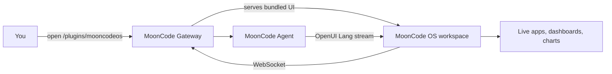

<div align="center">

<a href="https://www.openui.com/mooncode-os" target="_blank" rel="noopener noreferrer">

</a>

# MoonCode OS — The default workspace for MoonCode

[](https://github.com/thesysdev/mooncode-os/actions/workflows/build.yml)
[](./LICENSE)
[](https://discord.com/invite/Pbv5PsqUSv)

</div>

MoonCode reads emails, manages files, runs scripts, and schedules work across tools. But people drive it from Telegram, Discord, or Slack. Chat falls apart fast: everything scrolls away, work gets buried, and you can't see what's running or done.

**MoonCode-OS** is the missing interface. A workspace built for your agents. Sessions stay organized. Answers render as live, interactive apps (charts, tables, forms, dashboards) that persist, refresh with new data, and update from a prompt instead of a rebuild.

---

[Website](https://openui.com/mooncode-os) · [OpenUI Docs](https://openui.com) · [MoonCode](https://github.com/mooncode/mooncode) · [Discord](https://discord.com/invite/Pbv5PsqUSv) · [Contributing](./CONTRIBUTING.md) · [Code of Conduct](./CODE_OF_CONDUCT.md) · [Security](./SECURITY.md) · [License](./LICENSE)

---
## Quick Start

Install MoonCode OS into an existing MoonCode setup with the command for your platform:

macOS or Linux:

```bash
curl -fsSL https://openui.com/mooncode-os/install.sh | bash
```

Windows:

```powershell
powershell -c "irm https://openui.com/mooncode-os/install.ps1 | iex"
```

The installer downloads the latest source, builds the workspace UI, registers it as an MoonCode plugin, restarts the gateway, and opens the dashboard in your browser.

or through published package

```bash
mooncode plugins install @openuidev/mooncode-os-plugin
mooncode gateway restart
mooncode os url
```


> The workspace runs at `http://localhost:18789/plugins/mooncodeos`; run **`mooncode os url`** for the pre-authenticated URL.
>
> Don't have MoonCode yet? Install it first from [mooncode.ai](https://mooncode.ai/install.sh), then run the matching command above.
>
> Installing from a local clone: see [`CONTRIBUTING.md`](./CONTRIBUTING.md).

---

## What you get

- **A workspace, not a chat log.** Agents, sessions, apps, artifacts, notifications, and crons are all first-class surfaces in the sidebar — structured and easy to navigate.
- **Live, interactive apps.** Agents render dashboards, charts, tables, and forms as React components that stream in as the model writes them. No copy-pasting JSON, no re-prompting for the same data.
- **Persistent and refinable.** Apps and artifacts are stored and re-rendered across turns. Update them with a prompt — they update in place instead of being regenerated from scratch.
- **Mobile + desktop.** Responsive UI; the same workspace works on your laptop, phone, or tablet.
- **Lives with your gateway.** The workspace is served by your MoonCode gateway itself. If your gateway is remote, the workspace is reachable wherever the gateway is — no separate hosting, no tunnel, no CORS or allowed-origins config.
- **Session-scoped.** Only sessions opened from MoonCode OS get the OpenUI prompt. CLI runs, scripts, and other clients on the same gateway are unaffected.

---


## How it works

MoonCode OS ships as a single MoonCode plugin. When the gateway loads it, two things happen:

1. **The workspace UI is served from the gateway** at `http://<gateway>/plugins/mooncodeos`. The plugin bundles the prebuilt static export of the web client and serves it over the gateway's own HTTP route — no separate Next.js process, no tunnel, no CORS dance.
2. **Agent runs from MoonCode OS get an OpenUI prompt.** A `before_prompt_build` hook detects sessions originating from the workspace (by session-key suffix) and prepends an OpenUI Lang system prompt, so the LLM emits structured component markup the workspace can render.

The workspace then connects back to the same gateway over the same-origin WebSocket and renders the streaming output as live React components.



See [`AGENTS.md`](./AGENTS.md) for the full protocol, the plugin detection mechanism, and the agent / session / thread mental model.

---

## Packages

| Package | Description |
| :--- | :--- |
| [`@openuidev/mooncode-os-plugin`](./packages/mooncode-plugin) | The MoonCode plugin. Bundles the workspace UI, serves it over the gateway's HTTP route, and injects the OpenUI prompt for MoonCode OS sessions. |
| [`@openuidev/mooncode-client`](./packages/mooncode-client) | The workspace UI itself — a Next.js app rendered with the OpenUI React renderer. Statically exported, then bundled into the plugin. |

Both packages live in this monorepo and are linked via pnpm workspaces. They are versioned together for now.

---

## Repository structure

```
mooncode-os/
├── packages/
│   ├── mooncode-client/      # Workspace UI (Next.js, statically exported)
│   └── mooncode-plugin/      # MoonCode plugin (bundles + serves the UI)
├── scripts/              # Local helpers (open dashboard, etc.)
├── .github/              # CI workflows + issue / PR templates
├── AGENTS.md             # Protocol and mental-model deep dive
├── CONTRIBUTING.md       # Development workflow
└── README.md             # You are here
```

Good places to start:

- [`packages/mooncode-client`](./packages/mooncode-client) — the workspace UI
- [`packages/mooncode-plugin`](./packages/mooncode-plugin) — the plugin that ships and serves it
- [`AGENTS.md`](./AGENTS.md) — gateway protocol & session model
- [`CONTRIBUTING.md`](./CONTRIBUTING.md) — local setup, code style, PR workflow

---

## Scripts

Run from the repo root — every script fans out across the workspace.

```bash
pnpm build         # build every package
pnpm lint          # ESLint check across packages
pnpm lint:fix      # ESLint auto-fix
pnpm format        # Prettier check
pnpm format:fix    # Prettier write
pnpm typecheck     # tsc --noEmit across packages
pnpm test          # Vitest across packages
pnpm ci            # full lint + format + typecheck + build (matches CI)
```

---

## Powered by OpenUI

The workspace renders agent output using [OpenUI](https://openui.com), an open standard for generative UI. Agents emit OpenUI Lang — a structured, streamable language designed for model-generated UI:

- **Streaming output** — components render incrementally as tokens arrive.
- **Token efficient** — up to 67% fewer tokens than equivalent JSON.
- **Controlled rendering** — agents can only emit the components defined in the workspace's library.
- **Typed component contracts** — props are declared up front with Zod schemas.

See the [OpenUI documentation](https://openui.com) and [token efficiency benchmarks](https://github.com/thesysdev/openui#token-efficiency-benchmarks) for details.

---

## Documentation

- [openui.com/mooncode-os](https://openui.com/mooncode-os) — landing page, demos, install
- [openui.com](https://openui.com) — OpenUI Lang reference, component library, and renderer docs
- [`AGENTS.md`](./AGENTS.md) — MoonCode protocol, plugin detection, session model
- [`packages/mooncode-client/README.md`](./packages/mooncode-client/README.md) — workspace UI: local dev, env, layout
- [`packages/mooncode-plugin/README.md`](./packages/mooncode-plugin/README.md) — plugin: install, prompt regeneration

---

## Community

- [Discord](https://discord.com/invite/Pbv5PsqUSv) — Ask questions, share what you're building
- [GitHub Issues](https://github.com/thesysdev/mooncode-os/issues) — Report bugs or request features
- [GitHub Discussions](https://github.com/thesysdev/mooncode-os/discussions) — Longer-form questions and ideas

---

## Contributing

Contributions are welcome. See [`CONTRIBUTING.md`](./CONTRIBUTING.md) for the local setup, the code-style rules, and the pull request workflow.

## License

This project is available under the terms described in [`LICENSE`](./LICENSE).
